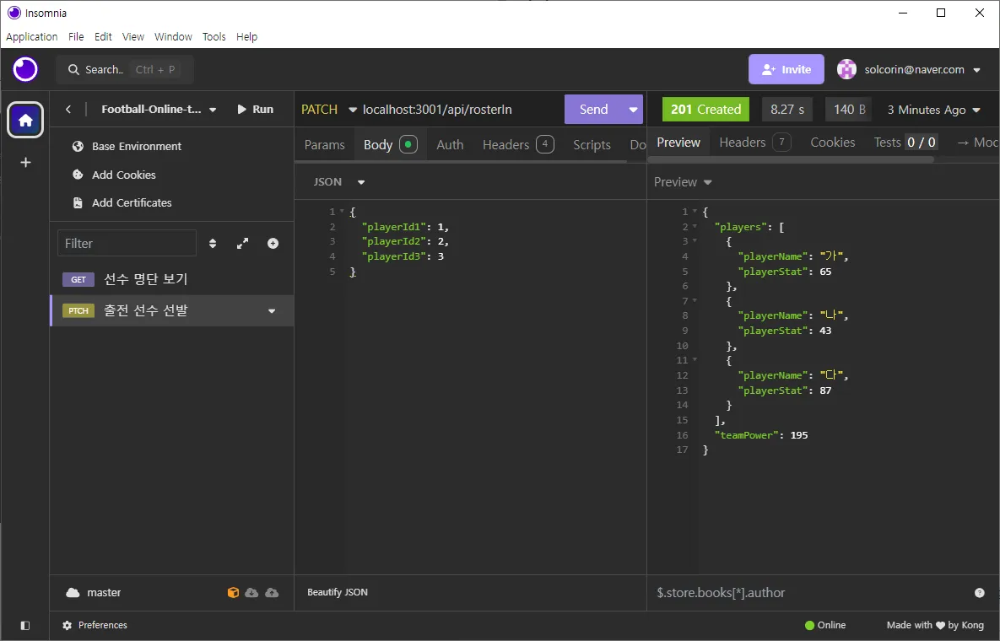

# Project_FutsalOnline

## WireFrame & ERD

## 프로젝트 결과

## 기능 요약

1. 로그인/회원가입 : 계정 생성, 로그인 인증 토큰 생성, 보안 관리, 매니저 관리

2. 캐시 상점 : 캐시 확인, 랜덤획득, 결제, 선물, 롤렛

3. 데이터 관리 : csv 파일 import, 선수 및 아이템 생성, 수정, 삭제

4. 선수 영입, 아이템 획득 : 가챠 형태로 선수 영입 및 아이템 획득

5. 팀 편성, 강화 : 선수 관리, 선발, 선발 변경, 강화 / 아이템 장착, 관리

6. 게임 플레이 : 일반 게임, 대장전, 랭크 매치

# API 상세 설명

- [API 명세서](https://teamsparta.notion.site/1532dc3ef51481ce9290cdd86c0b4ca8?v=1532dc3ef51481a68387000c348a65e8)

## 인증 시스템 (유대원)

## 결제 시스템 (윤예원)

## 선수 데이터 관리 (김종하)

## 선수 영입 (김정태)

## 프로젝트 진행 상황 정리

### 프론트


- 우리팀의 메인 화면!!!
- 주소를 입력하면 가장 먼저 보이는 화면입니다.
- 풋살이라는 장르 컨셉에 맞춰 배경에 축구영상을 배치하였습니다.


- 버튼을 누르면 서버로부터 결과물을 받아옵니다.
- 서버에서 전송된 정보를 바탕으로 애니메이션 후 출력합니다.


- 해당 기능도 아이템과 마찬가지로 진행됩니다.


- 선수 클릭시 자세한 내용을 볼 수 있습니다.

### 아이템 관련

- **아이템 가챠**: 프론트 제작이 완료되었습니다. 사용자들이 아이템을 획득할 수 있도록 인터페이스를 구성하였습니다.
- **아이템 리스트 확인**: 현재 프론트가 구현되어 있지 않습니다. 향후 개발 계획에 포함될 예정입니다.
- **선수 가챠**: 프론트 제작이 완료되었습니다. 선수 아이템을 획득할 수 있는 기능이 추가되었습니다.
- **단일 선수 정보 조회**: 프론트 제작이 완료되어, 사용자가 특정 선수의 정보를 쉽게 조회할 수 있도록 하였습니다.

### 어려움 및 도전 과제

#### 강력한 어려움

프로젝트 진행 중 여러 가지 강력한 어려움이 있었습니다.

- 번아웃의 경지에 이르러 작업의 압박이 상당했습니다.
- 프론트가 필요하다고 느낄 때마다 불안감이 커졌습니다.
- 인가 인증을 거쳐야만 제 코드를 실행할 수 있다는 제약이 있었습니다.
- 인가 인증이 실패했을 때는 작업이 중단되는 상황이 발생했습니다.
- 프리즈마에서 오류가 발생했을 때 주변에서 잘 된다고 하여 혼란스러웠습니다.
- 프리즈마의 데이터를 가져왔으나 저만 오류가 발생하여 스트레스를 받았습니다.
- 깃에서 충돌이 발생했을 때 어떤 부분이 변경되었는지 알 수 없어 매우 난감했습니다.
- 다른 파일을 Merge 한 이후에 잘 되다가 갑자기 오류가 발생했을 때 모듈을 삭제하고 재설치하면 문제가 해결되기도 했습니다.
- VSC를 나갔다가 다시 들어오면 문제가 해결되는 경우도 많았습니다.
- 실행이 안 된다고 팀원에게 말했을 때, 팀원이 볼 때 갑자기 실행이 잘 되는 상황도 있었습니다.
- 오류가 발생할 때마다 모듈을 삭제하고 다시 설치하며 VSC를 껐다 켜고
- 프리즈마 데이터를 불러오고
- 다른 팀원의 최신 브랜치를 병합하는 과정을 반복했습니다.

#### 중간의 어려움

현재 중간 단계에서 느끼는 어려움도 있었습니다.

- 반복적인 작업(노가다)이 많아 체력적으로 힘든 상황입니다.
- JavaScript 코드 스타일에 적응하는 데 시간이 걸리고 있어, 이 부분에서 다소 느린 진행 속도를 느끼고 있습니다.

결과

- 무엇 보다 깃 충돌 데이터 충돌 의 경험과 해당 충돌을 해결하는 과정이 가장 좋았습니다!!

## 팀 편성 (최슬기)

<details>
<summary>선수 명단 보기 API</summary>

- 보유한 선수 카드를 볼 수 있는 API입니다.</br>
- managerId 입력을 통해 선수들의 스탯을 확인하고 출전 선수로 선발할 수 있으며,</br>
  강화가 가능한 경우엔 강화 또한 진행할 수 있습니다.</br></br>

→ API 테스트 예시(서로 다른 테스트 테이블에서 진행)</br>
</br>
</br>

</details>

<details>
<summary>출전 선수 선발 API</summary>

- 게임에 출전하게 될 선수를 teamMemberId를 입력 받아 선발하는 API입니다.</br>
- 반드시 세 명의 Id를 입력받을 수 있게끔 유효성 검사를 넣어두었습니다. 세 명의 스탯을 DB를 통해 읽어와서 예상 점수 또한 확인할 수 있습니다.</br></br>

→ API 테스트 예시(서로 다른 테스트 테이블에서 진행)</br>
</br>
</br>

</details>

<details>
<summary>출전 선수 변경 API</summary>

- 출전 선수 중 한 명을 다른 선수와 교체할 수 있는 API입니다.</br></br>

→ API 테스트 예시</br>
</br>
1, 4, 5번 선수를 선발하고</br>
</br>
1번 선수를 3번 선수로 변경하면 다음과 같은 결과를 반환받을 수 있습니다.</br>
</br>
isSelected의 값이 제대로 변경된 모습을 DB를 통해서도 확인할 수 있습니다.

</details>

<details>
<summary>선수 카드 강화 API</summary>

- Manager가 보유한 선수 카드는 강화가 가능합니다. </br>
- 이를 위해선 (1)강화를 진행하려는 카드와 (2)강화의 재료로 쓰일 카드를 각각 선택해야합니다. </br>
- 이 두 장의 카드는 같은 playerId를 가지고 있어야 하며(같은 종류), 같은 등급이어야 합니다. </br>
- 성공하면 upgrade 수치가 상승하여, 팀의 예상점수 계산 시 해당 값이 반영됩니다. </br>
- 그러나 실패하게 되면 (1)번 카드의 등급이 현재 등급 미만의 랜덤한 등급으로 하락합니다.</br>
  → 강화 확률 = 1 / ((선수 등급) / 2 + 1) \* 100 (%)</br></br>

→ API 테스트 예시 - 강화 성공</br>
</br>
3번 계정이 49번과 43번 멤버를 소유하고 있습니다. 둘은 같은 종류/같은 등급의 선수입니다. 두 장의 선수 카드를 강화 API에 바쳐보겠습니다.</br>

</br>
결과는 성공!(등급이 0일 때 확률은 100퍼센트)</br>

</br>
49번의 upgrade 수치가 상승하고 43번이 사라진 것을 확인할 수 있습니다.

→ API 테스트 예시 - 강화 실패</br>

</br>
실패한 예시를 보여드리기 위해 등급이 1 올라간 두 카드(49번, 50번)를 준비했습니다.</br>

</br>
Insomnia로 API를 실행한 결과, 강화에 실패한 모습</br>
만약, 로직이 제대로 구현이 되어 있다면 강화 대상 카드였던 49번은 1 등급 미만의 카드로 강등당해야 하며, 50번 카드는 테이블에서 사라져야 합니다.</br>

</br>
예상한 것처럼 선수 카드가 강등되고 사라진 모습을 확인할 수 있었습니다.</br>

</details>

## 게임 플레이 (이기환)

- 일반 매치, 대장전, 랭킹전으로 3가지의 게임 플레이
- 일반 매치 : 선택된 3명의 능력치를 합산 후 비교 - 상대방 Id를 지정할 수 있다
- 일반 대장전 : 3명의 선수의 순서를 정하여 상대방이 선택한 선수와 순서대로 각 선수 개인의 능력치 비교 - 상대방의 Id를 지정할 수 있으며 승리 조건은 3판 2선으로 2개의 선수의 능력치가 해당 배열의 선수의 능력치보다 높아야 한다
- 랭킹전 : 선택한 선수들로 3:3 풋살 진행

### 게임 플레이 방식

<details>
<summary>함수 설명</summary>

1. calculateTeamPower(selectedPlayers)
    - 선택된 선수들의 전체 전투력을 계산
    - 각 선수의 능력치, 강화 수준, 장비를 고려하여 개별 전투력을 계산한 후 합산
2. generateOpponentPower(playerPower)
    - 상대방의 전투력을 생성
    - 플레이어 전투력의 80%에서 120% 사이의 랜덤한 값을 반환
3. determineWinner(myPower, opponentPower)
    - 승패를 결정
    - 전투력 차이에 따른 기본 승률을 계산하고, 랜덤 요소를 추가하여 최종 결과를 결정
4. calculatePlayerPower(player, upgrade, equipment)
    - 개별 선수의 전투력을 계산
    - 선수의 기본 능력치, 강화 수준, 장비 보너스를 고려함
5. updateGameResult(managerId, gameResult)
    - 게임 결과를 데이터베이스에 저장
    - 매니저의 레이팅, 랭킹 정보, 전적을 업데이트

게임 진행 예시

1. 팀 전투력 계산:

```
예를 들어, 3명의 선수가 있다고 가정했을 때,
- 선수1: 속도 80, 골 결정력 85, 슛 파워 75, 수비력 70, 체력 90
- 선수2: 속도 75, 골 결정력 80, 슛 파워 85, 수비력 75, 체력 85
- 선수3: 속도 85, 골 결정력 70, 슛 파워 80, 수비력 85, 체력 80
각 선수의 전투력을 계산하면:
- 선수1: (80 * 1.2) + (85 * 1.5) + (75 * 1.3) + (70 * 1.1) + (90 * 1.0) = 445.5
- 선수2: (75 * 1.2) + (80 * 1.5) + (85 * 1.3) + (75 * 1.1) + (85 * 1.0) = 445.5
- 선수3: (85 * 1.2) + (70 * 1.5) + (80 * 1.3) + (85 * 1.1) + (80 * 1.0) = 442.5
- 총 팀 전투력: 445.5 + 445.5 + 442.5 = 1333.5
```

2. 상대방 전투력 생성:

```
- 플레이어 팀 전투력이 1333.5라면, 상대방 전투력은 1066.8(80%)에서 1600.2(120%) 사이의 랜덤한 값이 됩니다.
예: 1400
```

3. 승패 결정:

```
- 전투력 차이: 1333.5 - 1400 = -66.5
- 기본 승률: 0.5 + (-66.5 / (1333.5 + 1400)) * 0.5 ≈ 0.4881 (48.81%)
- 랜덤 요소 (0~1 사이의 값): 예를 들어 0.6
- 결과: 0.6 > 0.4881이므로 패배
```

4. 결과 저장:

```
- 매니저의 레이팅 1점 감소
- 랭킹 테이블의 패배 횟수 1 증가
- 전적 테이블에 패배 기록 추가
```

</details>

<details>
<summary>게임 플레이 설명</summary>

1. 일반 게임

2. </details>
