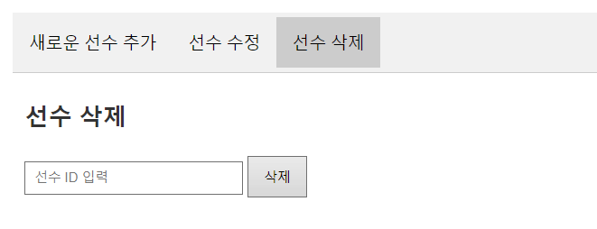

# Project_FutsalOnline

## WireFrame & ERD

- [WireFrame](https://app.eraser.io/workspace/cdioGb7CKtexTN17OBz2?origin=share) : 사용 도구 - EraserLabs
- [ERD](https://drawsql.app/teams/wakelight/diagrams/project-football) : 사용 도구 - DrawSQL

## 프로젝트 결과

- [프로젝트 시연 영상](https://youtu.be/7OGUQYB3zlk)
- [포트폴리오](https://docs.google.com/presentation/d/129RTr2qMWiEQcqZIr0hylciTT6P4LcL0cGj_1nbLKXA/edit?usp=sharing)

## 기능 요약

1. 로그인/회원가입 : 계정 생성, 로그인 인증 토큰 생성, 보안 관리, 매니저 관리

2. 캐시 상점 : 캐시 확인, 랜덤획득, 결제, 선물, 롤렛

3. 데이터 관리 : csv 파일 import, 선수 및 아이템 생성, 수정, 삭제

4. 선수 영입, 아이템 획득 : 가챠 형태로 선수 영입 및 아이템 획득

5. 팀 편성, 강화 : 선수 관리, 선발, 선발 변경, 강화 / 아이템 장착, 관리

6. 게임 플레이 : 일반 게임, 대장전, 랭크 매치

## File Directory

```
src/
|   app.js
|
+---logic
|       gameplay.js
|       simpleLogic.js
|
+---middlewares
|       auth.js
|       error-handling.middleware.js
|
+---routes
|   +---cash
|   |       cash.router.js
|   |
|   +---gacha
|   |       gacha.router.js
|   |
|   +---gameplay
|   |       captaingame.router.js
|   |       playgame.router.js
|   |       rankmatch.router.js
|   |       record.router.js
|   |
|   +---item
|   |       items.router.js
|   |
|   +---player
|   |       players.router.js
|   |
|   +---sign_login
|   |       checkManager.router.js
|   |       delete.router.js
|   |       manager.router.js
|   |       search.router.js
|   |       sign.router.js
|   |
|   \---teammember
|           createRoster.router.js
|           equipment.router.js
|           myTeamMember.router.js
|           upgradeMember.router.js
|
\---utils
    \---prisma
            index.js
```

# API 상세 설명

- [API 명세서](https://teamsparta.notion.site/1532dc3ef51481ce9290cdd86c0b4ca8?v=1532dc3ef51481a68387000c348a65e8)

## 인증 시스템 (유대원)

- 로그인 성공 시 생성되는 엑세스 토큰은 사용자의 로컬스토리지에, 리프레시 토큰은 db에 저장합니다.

<details>
<summary>핵심기능</summary>

- 사용자 회원가입 및 로그인 로그인 시 발행되는 토큰을 통해 인증 및 인가 진행 db에 저장된 리프레시 토큰을 통한 엑세스 토큰 재발행 사용자 개인 계정에 귀속되는 매니저 생성, 조회기능

</details>

<details>
<summary>인증 미들웨어</summary>

1. 엑세스 토큰이 유효할 때

    - jwt.verify를 통해 엑세스 토큰의 유효성을 검사합니다.
    - 유효한 경우 accountid를 조건으로, prisma.findFirst()를 통해 사용자 정보를 조회합니다.
    - 계정정보를 req.account에 저장하여 이후 API에서 사용할 수 있습니다.

2. 엑세스 토큰이 만료되었을 때

    - 만료된 토큰이 아닌 이메일 정보 헤더의 이메일을 통해 accountid를 도출합니다. 도출한 accountid로 db의 리프레시 토큰을 검증합니다.

3. 리프레시 토큰이 유효한 경우

    - 검증 후 새로운 엑세스 토큰을 생성합니다 계정정보를 req.account에 저장하여 이후 API에서 사용하고, 클라이언트 로컬저장소에 새로운 엑세스 토큰을 전달합니다.
    - 사용자 입장에서는 로그인 없이 요청-전달 과정이 진행됩니다.

4. 리프레시 토큰이 만료된 경우

    - 사용자가 다시 로그인하여 리프레시 토큰을 새로 생성해야합니다.

</details>

<details>
<summary>API</summary>

- 회원가입, 로그인 API

    - 회원가입 요청 시 서버로 전달된 정보에 대한 유효성을 검증하여 상태에 맞는 메시지를 클라이언트에 전달합니다.
    - (이메일(id) 형식, 비밀번호 길이 등등) 검증 완료 시 db에 accountid를 순서대로 할당하여 저장합니다.
    - 로그인 요청 시 서버로 전달된 이메일, 비밀번호를 통해 db의 정보와 비교합니다. 로그인에 성공하면 엑세스토큰을 클라이언트에 전달하고, 리프레시 토큰을 db에 저장합니다.

- 매니저 생성 API

    - 매니저 생성 요청 시 서버로 전달된 닉네임의 중복 여부를 검증하고 인증 미들웨어에서 인증을 성공하여 전달받은 req.account에서 계정정보를 가져옵니다.
    - 계정정보를 통해 매니저의 존재 유무를 확인하고, 없다면 입력한 닉네임, 기본 캐쉬, 기본 레이팅을 적용한 매니저를 생성합니다.(매니저는 계정당 1개만 생성할 수 있습니다)

- 랭킹 조회 API
    - db에 존재하는 모든 매니저를 레이팅 내림차순으로 정렬합니다.

</details>

## 결제 시스템 (윤예원)

<details>
<summary>결제 시스템 설명</summary>

- 로그인을 통해 토큰을 발급받은 후에 사용할 수 있습니다.
- Lucky캐시API
    - 랜덤으로 20~220 사이의 캐시를 지급합니다.
- 캐시 구매API
    - 비밀번호와 구매하려는 캐시를 입력하면 구매됩니다.
    - 캐시 컬럼을 INT로 만들어서 1~21억사이의 캐시를 수배할 수 있게 만들었습니다.
- 캐시 조회API
    - 본인의 캐시만 조회 가능합니다.
- 다른 유저에게 캐시 선물API
    - 수신자 이메일, 선물캐시량, 비밀번호를 입력 받아 송금합니다.
    - 선물캐시량 + 수신자의 현재 캐시량이 2147483640(int 한계)이 넘거나 수신자의 보유캐시보다 큰 값을 선물하려 할 때 정정 을 요구하는 에러처리를 추가했습니다.
- 돈 불리기 ( 행운의 룰렛)API
    - 룰렛을 돌려 배팅한 캐시의 n배의 캐시를 돌려받습니다.

</details>

## 데이터 관리 (김종하)

- 페이지 로드시 로그인 및 어드민 확인
    - get /players/admin
    - 페이지가 로드될때 데이터 변경하는 다음의 UI를 보여줄지 결정한다.
        - csv 파일 업로드
        - 새로운 선수 추가
        - 선수 수정
        - 선수 삭제
        - 새로운 아이템 추가
        - 아이템 수정
        - 아이템 삭제

<details>
<summary>선수 데이터 관리</summary>

</br>

- 선수 목록 조회
    - get ./api/players
    - 로그인 여부 상관없이 전체 선수 목록 조회
- 선수 상세 조회
    - get ./api/players/playerId
    - 입력된 선수 id에 따라서 데이터 조회
- csv 파일 업로드
    - 어드민 계정 로그인시에만 표시
    - post ./api/players/csv
    - 파일 선택을 눌러 csv 파일을 선택하고 업로드를 눌러 데이터베이스에 추가
    - 예시 파일 [player](attachment/CSVfiles/england-premier-league-players-2018-to-2019-stats.csv)
- 새로운 선수 추가
    - </br>
    - 어드민 계정 로그인시에만 표시
    - post ./api/players
    - 데이터를 입력후 추가를 눌러 추가
- 선수 수정
    - </br>
    - 어드민 계정 로그인시에만 표시
    - post ./api/players/playerId
    - 데이터를 입력후 수정을 눌러 수정
- 선수 삭제
    - </br>
    - 어드민 계정 로그인시에만 표시
    - delete ./api/players/playerId
    - 선수 ID를 입력하고 삭제를 눌러 삭제

</details>

<details>
<summary>아이템 데이터 관리</summary>

</br>

- 아이템 목록 조회
    - get ./api/items
    - 로그인 여부 상관없이 전체 아이템 목록 조회
- 아이템 상세 조회
    - get ./api/items/itemId
    - 입력된 아이템 id에 따라서 데이터 조회
- csv 파일 업로드
    - 어드민 계정 로그인시에만 표시
    - post ./api/items/csv
    - 파일 선택을 눌러 csv 파일을 선택하고 업로드를 눌러 데이터베이스에 추가
    - 예시 파일 [item](attachment/CSVfiles/item.csv)
- 새로운 아이템 추가
    - </br>
    - 어드민 계정 로그인시에만 표시
    - post ./api/items
    - 데이터를 입력후 추가를 눌러 추가
- 아이템 수정
    - </br>
    - 어드민 계정 로그인시에만 표시
    - post ./api/items/itemId
    - 데이터를 입력후 수정을 눌러 수정
- 아이템 삭제
    - </br>
    - 어드민 계정 로그인시에만 표시
    - delete ./api/items/itemId
    - 아이템 ID를 입력하고 삭제를 눌러 삭제

</details>

## 선수 영입 (김정태)

<details>
<summary>Frontend</summary>


- 우리팀의 메인 화면!!!
- 주소를 입력하면 가장 먼저 보이는 화면입니다.
- 풋살이라는 장르 컨셉에 맞춰 배경에 축구영상을 배치하였습니다.


- 버튼을 누르면 서버로부터 결과물을 받아옵니다.
- 서버에서 전송된 정보를 바탕으로 애니메이션 후 출력합니다.


- 해당 기능도 아이템과 마찬가지로 진행됩니다.


- 선수 클릭시 자세한 내용을 볼 수 있습니다.

</details>

<details>
<summary>아이템 관련</summary>

### 아이템 관련

- **아이템 가챠**: 프론트 제작이 완료되었습니다. 사용자들이 아이템을 획득할 수 있도록 인터페이스를 구성하였습니다.
- **아이템 리스트 확인**: 현재 프론트가 구현되어 있지 않습니다. 향후 개발 계획에 포함될 예정입니다.
- **선수 가챠**: 프론트 제작이 완료되었습니다. 선수 아이템을 획득할 수 있는 기능이 추가되었습니다.
- **단일 선수 정보 조회**: 프론트 제작이 완료되어, 사용자가 특정 선수의 정보를 쉽게 조회할 수 있도록 하였습니다.

### 어려움 및 도전 과제

</details>

<details>
<summary>어려웠던 점</summary>

#### 강력한 어려움

프로젝트 진행 중 여러 가지 강력한 어려움이 있었습니다.

- 번아웃의 경지에 이르러 작업의 압박이 상당했습니다.
- 프론트가 필요하다고 느낄 때마다 불안감이 커졌습니다.
- 인가 인증을 거쳐야만 제 코드를 실행할 수 있다는 제약이 있었습니다.
- 인가 인증이 실패했을 때는 작업이 중단되는 상황이 발생했습니다.
- 프리즈마에서 오류가 발생했을 때 주변에서 잘 된다고 하여 혼란스러웠습니다.
- 프리즈마의 데이터를 가져왔으나 저만 오류가 발생하여 스트레스를 받았습니다.
- 깃에서 충돌이 발생했을 때 어떤 부분이 변경되었는지 알 수 없어 매우 난감했습니다.
- 다른 파일을 Merge 한 이후에 잘 되다가 갑자기 오류가 발생했을 때 모듈을 삭제하고 재설치하면 문제가 해결되기도 했습니다.
- VSC를 나갔다가 다시 들어오면 문제가 해결되는 경우도 많았습니다.
- 실행이 안 된다고 팀원에게 말했을 때, 팀원이 볼 때 갑자기 실행이 잘 되는 상황도 있었습니다.
- 오류가 발생할 때마다 모듈을 삭제하고 다시 설치하며 VSC를 껐다 켜고
- 프리즈마 데이터를 불러오고
- 다른 팀원의 최신 브랜치를 병합하는 과정을 반복했습니다.

#### 중간의 어려움

현재 중간 단계에서 느끼는 어려움도 있었습니다.

- 반복적인 작업(노가다)이 많아 체력적으로 힘든 상황입니다.
- JavaScript 코드 스타일에 적응하는 데 시간이 걸리고 있어, 이 부분에서 다소 느린 진행 속도를 느끼고 있습니다.

결과

- 무엇 보다 깃 충돌 데이터 충돌 의 경험과 해당 충돌을 해결하는 과정이 가장 좋았습니다!!

</details>

## 팀 편성 (최슬기)

<details>
<summary>선수 명단 보기 API</summary>

- 보유한 선수 카드를 볼 수 있는 API입니다.</br>
- managerId 입력을 통해 선수들의 스탯을 확인하고 출전 선수로 선발할 수 있으며,</br>
  강화가 가능한 경우엔 강화 또한 진행할 수 있습니다.</br></br>

→ API 테스트 예시(서로 다른 테스트 테이블에서 진행)</br>
</br>
</br></br>

→ 프론트엔드 구현</br>


</details>

<details>
<summary>출전 선수 선발 API</summary>

- 게임에 출전하게 될 선수를 teamMemberId를 입력 받아 선발하는 API입니다.</br>
- 반드시 세 명의 Id를 입력받을 수 있게끔 유효성 검사를 넣어두었습니다. 세 명의 스탯을 DB를 통해 읽어와서 예상 점수 또한 확인할 수 있습니다.</br></br>

→ API 테스트 예시(서로 다른 테스트 테이블에서 진행)</br>
</br>
</br></br>

→ 프론트엔드 구현</br>


</details>

<details>
<summary>출전 선수 변경 API</summary>

- 출전 선수 중 한 명을 다른 선수와 교체할 수 있는 API입니다.</br></br>

→ API 테스트 예시</br>
</br>
1, 4, 5번 선수를 선발하고</br>
</br>
1번 선수를 3번 선수로 변경하면 다음과 같은 결과를 반환받을 수 있습니다.</br>
</br>
isSelected의 값이 제대로 변경된 모습을 DB를 통해서도 확인할 수 있습니다.</br>

→ 프론트엔드 구현</br>


</details>

<details>
<summary>선수 카드 강화 API</summary>

- Manager가 보유한 선수 카드는 강화가 가능합니다. </br>
- 이를 위해선 (1)강화를 진행하려는 카드와 (2)강화의 재료로 쓰일 카드를 각각 선택해야합니다. </br>
- 이 두 장의 카드는 같은 playerId를 가지고 있어야 하며(같은 종류), 같은 등급이어야 합니다. </br>
- 성공하면 upgrade 수치가 상승하여, 팀의 예상점수 계산 시 해당 값이 반영됩니다. </br>
- 그러나 실패하게 되면 (1)번 카드의 등급이 현재 등급 미만의 랜덤한 등급으로 하락합니다.</br>

- 강화 로직
  → 강화 확률 = 1 / ((선수 등급) / 2 + 1) \* 100 (%)</br></br>

```javascript
await prisma.$transaction(
    async (tx) => {
        // (1) 강화 확률 구하기 위해 랜덤 밸류를 생성하고 비교합니다.
        const probability = (1 / ((playerUpgrades[0] * 1) / 2 + 1)) * 100;
        const randomValue = Math.floor(Math.random() * 101); // 0이상 100이하의 랜덤한 정수 뽑기

        // (2) 강화가 실패했을 때
        if (randomValue > probability) {
            // 등급 하락
            const randomGrade = Math.floor(Math.random() * playerUpgrades[0]); // 0 이상 기존 등급 미만의 랜덤한 등급
            await tx.teamMember.update({
                where: {
                    managerId: managerId.managerId,
                    teamMemberId: memberIds[0],
                },
                data: {
                    upgrade: randomGrade,
                },
            });
            // 재료 카드 파괴
            await tx.teamMember.delete({
                where: {
                    managerId: managerId.managerId,
                    teamMemberId: memberIds[1],
                },
            });
            const degradedMember = await tx.player.findFirst({
                where: {
                    playerId: playerIds[0],
                },
                select: {
                    name: true,
                    club: true,
                },
            });
            const degradedNumber = await tx.teamMember.findFirst({
                where: {
                    teamMemberId: memberIds[0],
                },
                select: {
                    upgrade: true,
                },
            });

            return res.status(200).json({
                message: '강화에 실패하였습니다. 재료 카드가 파괴되었습니다.',
                degradedMember,
                degradedNumber,
            });
        }

        // (2) 강화가 성공했을 때
        await tx.teamMember.update({
            where: {
                teamMemberId: memberIds[0],
            },
            data: {
                upgrade: { increment: 1 },
            },
        });
        // 재료 카드 소모
        await tx.teamMember.delete({
            where: {
                teamMemberId: memberIds[1],
            },
        });
        const upgradedMember = await tx.player.findFirst({
            where: {
                playerId: playerIds[0],
            },
            select: {
                name: true,
                club: true,
            },
        });
        const upgradedNumber = await tx.teamMember.findFirst({
            where: {
                teamMemberId: memberIds[0],
            },
            select: {
                upgrade: true,
            },
        });

        return res.status(200).json({
            message: '강화에 성공하였습니다. 재료 카드가 소모되었습니다.',
            upgradedMember,
            upgradedNumber,
        });
    },
    {
        isolationLevel: Prisma.TransactionIsolationLevel.ReadCommitted,
    }
);
```

→ API 테스트 예시 - 강화 성공</br>
</br>
3번 계정이 49번과 43번 멤버를 소유하고 있습니다. 둘은 같은 종류/같은 등급의 선수입니다. 두 장의 선수 카드를 강화 API에 바쳐보겠습니다.</br>

</br>
결과는 성공!(등급이 0일 때 확률은 100퍼센트)</br>

</br>
49번의 upgrade 수치가 상승하고 43번이 사라진 것을 확인할 수 있습니다.

→ API 테스트 예시 - 강화 실패</br>

</br>
실패한 예시를 보여드리기 위해 등급이 1 올라간 두 카드(49번, 50번)를 준비했습니다.</br>

</br>
Insomnia로 API를 실행한 결과, 강화에 실패한 모습</br>
만약, 로직이 제대로 구현이 되어 있다면 강화 대상 카드였던 49번은 1 등급 미만의 카드로 강등당해야 하며, 50번 카드는 테이블에서 사라져야 합니다.</br>

</br>
예상한 것처럼 선수 카드가 강등되고 사라진 모습을 확인할 수 있었습니다.</br>

→ 프론트엔드 구현</br>


</details>

<details>
<summary>아이템 장착 API</summary>
사용자의 아이템을 조회하는 API와 아이템을 장착하는 API를 이용하여 선수별로 아이템을 장착할 수 있는 프론트엔드를 구현했습니다.</br></br>

→ 프론트엔드 구현</br>


</details>

## 게임 플레이 (이기환)

<details>
<summary>게임 플레이 설명</summary>

- 일반 매치, 대장전, 랭킹전으로 3가지의 플레이 방법이 있습니다

1. 일반 매치 :

    - 상대방 Id를 선택할 수 있습니다.
      (단, 상대방의 Id만 입력할 수 있을 뿐 상대방의 전투력 데이터는 알 수 없습니다.)
    - 선택된 3명의 능력치를 합산 후 비교합니다.
    - 사용자 선수와 상대방 선수의 합산 능력치를 비교했을 때 승률을 계산합니다
    - randomFactor라는 0~1까지 랜덤 수와 승률을 비교하여 게임의 승/패/무를 결정합니다.
    - 결과를 출력하고 전적을 Ranking, Record 테이블에 저장합니다.

2. 대장전 :

    - 3명의 선수의 순서를 정하여 상대방이 선택한 선수와 순서대로 각 선수 개인의
      능력치를 비교합니다.
    - 상대방의 Id를 지정할 수 있으며 승리 조건은 3판 2선으로 2개의 선수의 능력치가 해당 배열의 선수의 능력치보다 높아야 합니다
    - 결과에 대한 내용을 Ranking, Record 테이블에 저장합니다.

3. 랭크 매치 :

    - 선택한 선수들로 3:3 풋살 시뮬레이션을 진행합니다.
    - 랭크 매치는 정해진 레이팅 범위에 따라서 랜덤 매칭으로 진행됩니다
    - 골을 넣는 확률이 존재하고 선수의 능력치로 확률이 계산됩니다.
    - 능력치가 높은 선수가 골을 넣었을 경우 게임이 종료됩니다.
    - 결과를 출력하고 전적을 Ranking, Record 테이블에 저장합니다.

</details>

<details>
<summary>게임 로직 설명</summary>

<details>
<summary>1. 일반 매치 게임</summary>

### 로직 설명

1. calculateTeamPower(selectedPlayers)
    - 선택된 선수들의 전체 전투력을 계산합니다.
    - 각 선수의 능력치, 강화 수준, 장비를 고려하여 개별 전투력을 계산한 후 합산합니다.
2. generateOpponentPower(playerPower)
    - 상대방의 전투력을 생성합니다.
    - 플레이어 전투력의 80%에서 120% 사이의 랜덤한 값을 반환합니다.
3. determineWinner(myPower, opponentPower)
    - 승패를 결정합니다.
    - 전투력 차이에 따른 기본 승률을 계산하고, 랜덤 요소를 추가하여 최종 결과를 .결정합니다
4. calculatePlayerPower(player, upgrade, equipment)
    - 개별 선수의 전투력을 계산합니다.
    - 선수의 기본 능력치, 강화 수준, 장비 보너스를 고려합니다.
5. updateGameResult(managerId, gameResult)
    - 게임 결과를 데이터베이스에 저장합니다.
    - 매니저의 레이팅, 랭킹 정보, 전적을 업데이트를 진행합니다.

### 게임 진행 예시

1. 팀 전투력 계산:

```
예를 들어, 3명의 선수가 있다고 가정했을 때,
- 선수1: 속도 80, 골 결정력 85, 슛 파워 75, 수비력 70, 체력 90
- 선수2: 속도 75, 골 결정력 80, 슛 파워 85, 수비력 75, 체력 85
- 선수3: 속도 85, 골 결정력 70, 슛 파워 80, 수비력 85, 체력 80
각 선수의 전투력을 계산하면:
- 선수1: (80 * 1.2) + (85 * 1.5) + (75 * 1.3) + (70 * 1.1) + (90 * 1.0) = 445.5
- 선수2: (75 * 1.2) + (80 * 1.5) + (85 * 1.3) + (75 * 1.1) + (85 * 1.0) = 445.5
- 선수3: (85 * 1.2) + (70 * 1.5) + (80 * 1.3) + (85 * 1.1) + (80 * 1.0) = 442.5
- 총 팀 전투력: 445.5 + 445.5 + 442.5 = 1333.5
```

2. 상대방 전투력 생성:

```
- 플레이어 팀 전투력이 1333.5라면, 상대방 전투력은 1066.8(80%)에서 1600.2(120%) 사이의 랜덤한 값이 됩니다.
예: 1400
```

3. 승패 결정:

```
- 전투력 차이: 1333.5 - 1400 = -66.5
- 기본 승률: 0.5 + (-66.5 / (1333.5 + 1400)) * 0.5 ≈ 0.4881 (48.81%)
- 랜덤 요소 (0~1 사이의 값): 예를 들어 0.6
- 결과: 0.6 > 0.4881이므로 패배
```

4. 결과 저장:

```
- 매니저의 레이팅 1점 감소
- 랭킹 테이블의 패배 횟수 1 증가
- 전적 테이블에 패배 기록 추가
```

</details>

<details>
<summary>2. 대장전</summary>

### 로직 설명

1. 라운드마다 각 선수가 배열에 입력된 순서대로 상대방 선수와 능력치 비교합니다.
2. 'calculatePlayerPower' 함수를 사용하여 상대방 선수의 능력치를 계산합니다.
3. 사용자 선수와 상대방 선수의 능력치를 비교하여 승패를 결정합니다.

### 작동 예시

```javascript
gameSession.selectedPlayers = [
    { playerId: 1, power: 100, name: 'A', upgrade: 1 },
    { playerId: 2, power: 90, name: 'B', upgrade: 0 },
    { playerId: 3, power: 110, name: 'C', upgrade: 2 },
];

opponentPlayers = [
    { player: { playerId: 4, name: 'X' }, upgrade: 1 },
    { player: { playerId: 5, name: 'Y' }, upgrade: 2 },
    { player: { playerId: 6, name: 'Z' }, upgrade: 0 },
];

// 가정: calculatePlayerPower 함수가 다음과 같이 결과를 반환한다고 가정
// calculatePlayerPower(opponentPlayers[0].player, 1) => 95
// calculatePlayerPower(opponentPlayers[1].player, 2) => 105
// calculatePlayerPower(opponentPlayers[2].player, 0) => 100
```

- 사용자 1번째 선수와 상대방 1번째 선수 비교 - 승리
- 사용자 2번째 선수와 상대방 2번째 선수 비교 - 패배
- 사용자 3번째 선수와 상대방 3번째 선수 비교 - 승리
- 3 round 중 2 round 승리로 승리를 기록합니다

```javascript
matches = [
    {
        round: 1,
        myPlayer: { playerId: 1, power: 100, name: 'A', upgrade: 1 },
        opponentPlayer: { playerId: 4, power: 95, name: 'X', upgrade: 1 },
        result: '승리',
    },
    {
        round: 2,
        myPlayer: { playerId: 2, power: 90, name: 'B', upgrade: 0 },
        opponentPlayer: { playerId: 5, power: 105, name: 'Y', upgrade: 2 },
        result: '패배',
    },
    {
        round: 3,
        myPlayer: { playerId: 3, power: 110, name: 'C', upgrade: 2 },
        opponentPlayer: { playerId: 6, power: 100, name: 'Z', upgrade: 0 },
        result: '승리',
    },
];
```

</details>

<details>
<summary>3. 랭크 매치 게임</summary>

### 로직 설명

1. 초기 설정

- myScore와 opponentScore는 각 팀의 득점을 추적합니다.
- matchLog 배열은 경기 진행 상황을 기록합니다.

2. playRound 함수

- 이 함수는 한 라운드의 경기를 시뮬레이션합니다.
- 모든 선수(myPlayers와 opponentPlayers)를 능력치(power) 기준으로 내림차순 정렬합니다.
- 정렬된 선수들을 순회하며 각 선수의 득점 가능성을 계산합니다.
  득점 확률 계산

3. goalProbability = player.power / 1000로 계산됩니다.

- 예를 들어, 선수의 power가 500이면 득점 확률은 50%입니다.

4. 득점 시뮬레이션

- Math.random() < goalProbability를 통해 실제 득점 여부를 결정합니다.
- 득점 시 해당 팀의 점수를 증가시키고 로그에 기록합니다.

5. 경기 종료 조건

- 한 팀이 득점하여 동점이 깨지면 해당 라운드를 종료합니다.

### 작동 예시

```javascript
const myPlayers = [
    { name: 'A', power: 600 },
    { name: 'B', power: 450 },
    { name: 'C', power: 300 },
];

const opponentPlayers = [
    { name: 'X', power: 550 },
    { name: 'Y', power: 500 },
    { name: 'Z', power: 400 },
];
```

1. 선수 정렬

- 정렬 후 순서: A(600), X(550), Y(500), B(450), Z(400), C(300)

2. 첫 라운드 시뮬레이션

- A의 득점 확률: 60%, X의 득점 확률: 55%, Y의 득점 확률: 50% ...
- 가정: A가 득점에 성공했다면

```
myScore: 1
opponentScore: 0
matchLog: ["A이(가) 골을 넣었습니다!"]
```

3. 추가 라운드

- 동점이 될 때까지 라운드를 반복합니다.
- 예를 들어, 다음 라운드에서 X가 득점하면 동점이 되어 계속 진행됩니다.

4. 경기 종료

- 최종적으로 한 팀이 앞서게 되면 경기가 종료됩니다.

</details>

</details>

## 기술 스택

### Back-end


